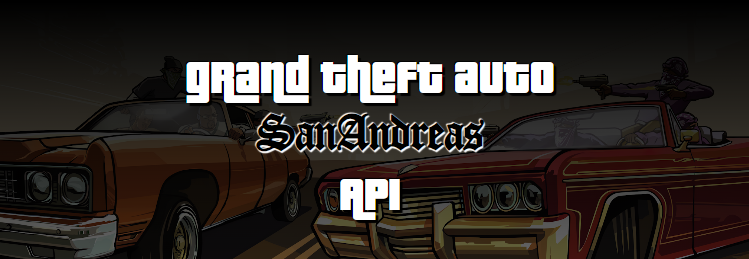

# Gta San Andreas API

- [Estado](#estado)
- [Descrição do Projeto](#descrição-do-projeto)
- [Tecnologias Utilizadas](#tecnologias-utilizadas)
- [Instruções](#instruções)
- [Licença](#licença)

## Estado
Em Andamento

## Descrição do Projeto
Uma Api Rest(Não oficial) para obter dados de personagens do jogo Grand Theft Auto: San Andreas

## Tecnologias Utilizadas

<div>
  
        
  
  
                            
</div>

## Instruções
  ### Clone o repositório

  ```bash
    git clone https://github.com/CristianoMends/SA-CHARACTER-API
  ```
  ### Intellij:      
  Apenas abra a pasta do projeto!
  
  ### bash:
  ### Acesse o diretorio do projeto
  ```bash
    cd C:\Users\seu-usuario\Documents\SA-CHARACTER-API
  ``` 
  Troque pelo endereco da pasta raiz clonada

  ### Construa o projeto
  ```bash
    gradlew build
  ```
  ### Acesse a pasta do .jar gerado e execute
  ```bash
    java -jar build/libs/sa-characters-api-0.0.1-SNAPSHOT-plain.jar
  ```

          
## Licença
Este projeto é licenciado sob os termos da [Licença MIT](LICENSE).
